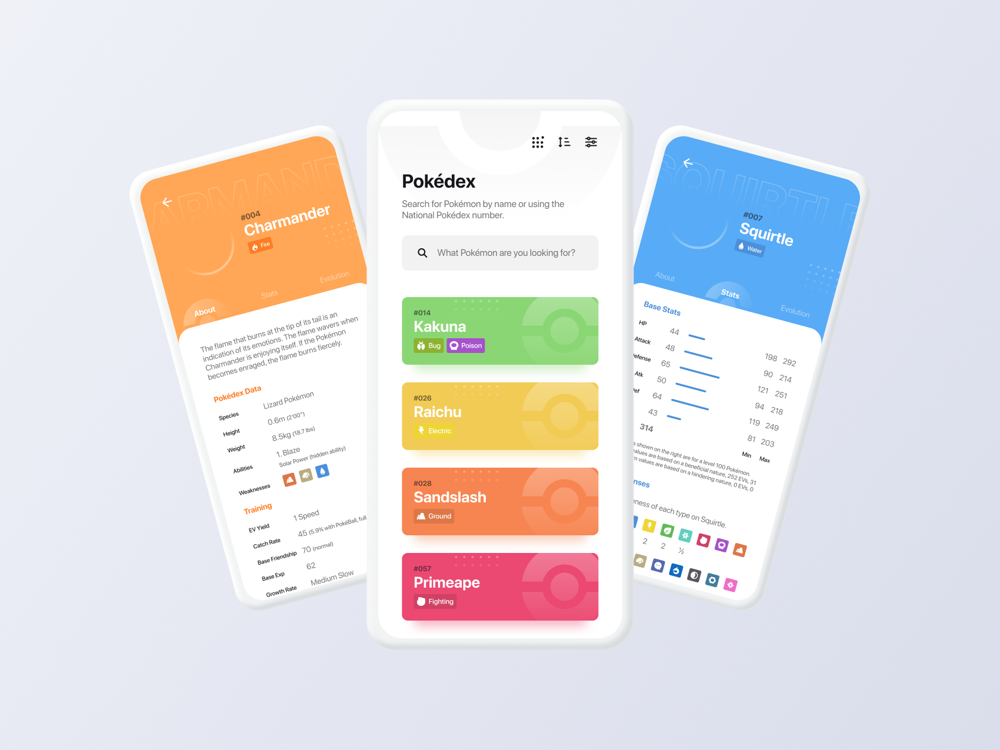

 

    

  <h3 align="center">Pokedex by <a href="https://umpontoseis.com/">umpontoseis</a></h3>
  
  

     App para buscar pokémons
        
     
    <a href="https://github.com/Lorenalgm/pokedex">Desafio</a>
    ·
    <a href="https://www.devchallenge.com.br/">DevChallenge</a>
  

## Índice

* [Devchallenge](#devchallenge) 
* [Desafio](#desafio)
* [Techs](#techs)
* [Como começar](#como-começar)
* [Dicas](#dicas)  
  * [Dados](#dados)
  * [Modelo](#modelo)
  * [Imagens](#imagens)
  * [Icones](#icones)
  * [Tipo de fonte](#tipo-de-fonte)
* [Compartilhe](#compartilhe)

# Devchallenge
<a href="https://devchallenge.now.sh/"> DevChallenge</a> permite que você evolua suas skills como programador! Participe da nossa <a href="https://discord.gg/yvYXhGj">comunidade</a> o/

# Desafio
Seu desafio é criar um app para buscar pokémons, filtrando por tipos, além de visualizar mais informações dos personagens.

## Requisitos:
- Criar uma tela inicial listando todos os pokemons 
- Adicionar filtros, podendo ser por: tipos, fraquezas, alturas, pesos e quantitativo de números 
- Ao clicar em um personagem, o usuário será redirecionado para o perfil do mesmo, onde conterá mais informações como dados de treinamento, inicadores, tipos de defesa e evoluções.

## Requisitos extras:
- Adicionar opção para ordenar por ordem alfabética ou numeração
- Adicionar filtro por gerações de pokemons

# Techs: 
- React Native, Vue Native, Flutter ou a linguagem que você preferir :)

# Como começar:
1 - Use esse template (clicando em Use this template) ou faça um fork deste repositório com o código inicial 
2 - Leia as instruções no readme.md 
3 - Comece a codar! Sinta-se livre para utilizar o fluxo de trabalho que ache mais confortável 
4 - Compartilhe seu resultado com a comunidade! #devchallenge

# Dicas

## Dados:
Para listar os dados, você pode utilizar os dados na API da PokéApi, dá uma olhadinha na documentação: https://pokeapi.co/

## Modelo:
O modelo final do app está disponível na pasta `./design` e também no Figma da umpontoseis: 
https://www.figma.com/file/THLxZSlOoUYMZrjFg0Kl1M/Pok%C3%A9dex?node-id=218%3A4647

## Icones
Os ícones estão disponíveis na pasta `./assets/icons`

## Tipo de fonte:
- SF pro display. Disponível na pasta `./assets/fonts`

# Compartilhe!
Inicie seu projeto utilizando esse template no seu github como um repositório público 
Faça um print, gif ou vídeo e compartilhe o resultado com a #devchallenge ou marcando nosso perfil @devchallenge! 

Desafio criado por  <a href="https://umpontoseis.com/">umpontoseis</a> :)

# Comunidade DevChallenge
Site: https://www.devchallenge.com.br/  
Discord: https://discord.gg/yvYXhGj  
Linkedin: https://www.linkedin.com/company/devchallenge/ 
Twitter: https://twitter.com/dev_challenge 
Instagram: https://www.instagram.com/devchallenge/ 
